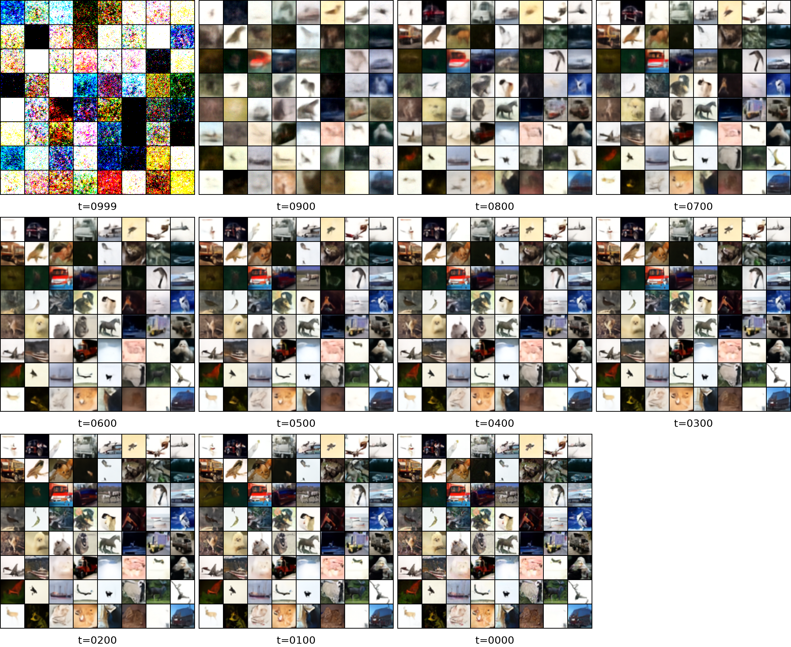

1. Trying to save images generated from Model_A(Cifar-10, seed=0) at each time step(999, 900, 800, …, 100, 0).
2. The trouble we’re facing is that those saved images don't look quite right.
3. Problems solved, we can see the images (model’s prediction) at each time step we want.

x0pred: what the model believes the final image should be at that moment

xt_quickview: what xt roughly looks like if we force it into image range (high-dimensional noisy tensor)

## Diffusion Denoising Timeline

### Model A (Seed=0) Denoising Trajectory (x0 Predictions)

### Noisy Latent States (xt Quickview)

