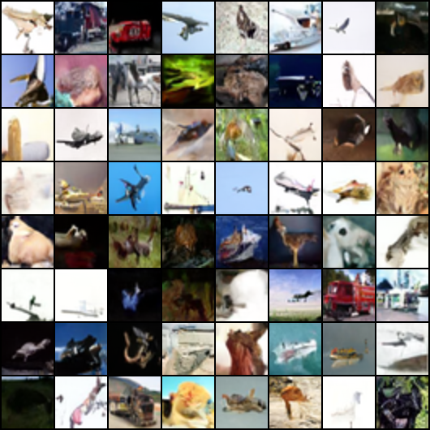
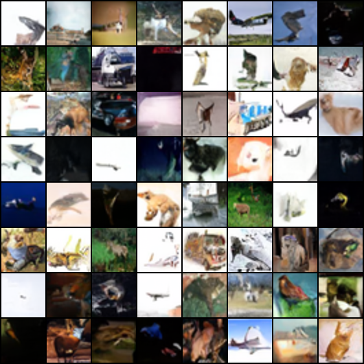
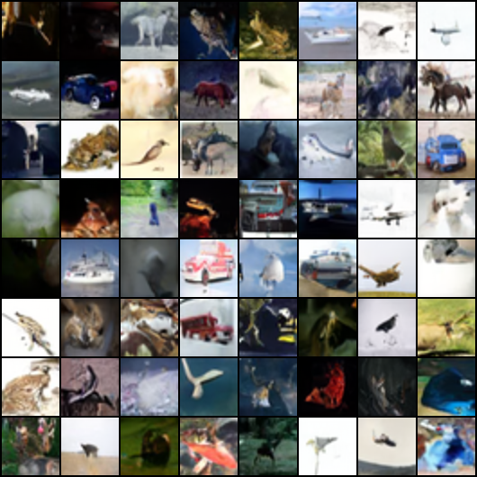
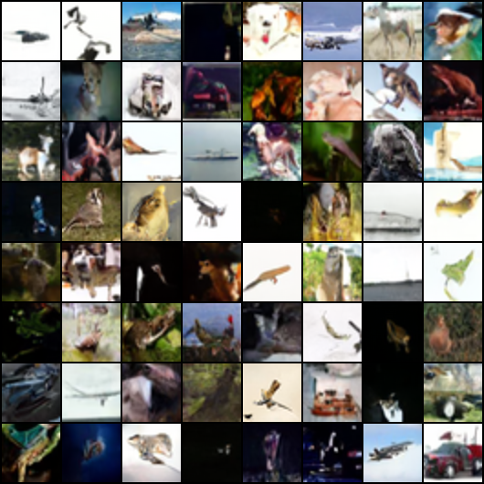

1) Trying to figure out why the model A has generated the same images without the given values to its noise seed
  - Possibility 1: deterministic flags somewhere (if CUDA deterministic settings were enabled)
  - Possibility 2: scheduler randomness dominates (if schedular variance is small or deterministic)

2) Checked the json file of scheduler; didn't find anything that could possibly interrupt the model's generalizability randomness

3) Replaced the code block; references below

BEFORE

    g_noise = torch.Generator(device="cpu")
    if noise_seed is not None:
        g_noise.manual_seed(int(noise_seed))

    g_step = torch.Generator(device="cpu")
    if step_seed is not None:
        g_step.manual_seed(int(step_seed))
AFTER

    g_noise = None
    if noise_seed is not None:
        g_noise = torch.Generator(device="cpu").manual_seed(int(noise_seed))

    g_step = None
    if step_seed is not None:
        g_step = torch.Generator(device="cpu").manual_seed(int(step_seed))

 Now, the images generated without setting "Noise Seed" at two different times look different

  
  

4) Trying to figure out how I could have the model's reproducibility even without the presense of step seed

5) Editted the script to not have step seed, ran it twice with noise seed given at 1234

  
  

